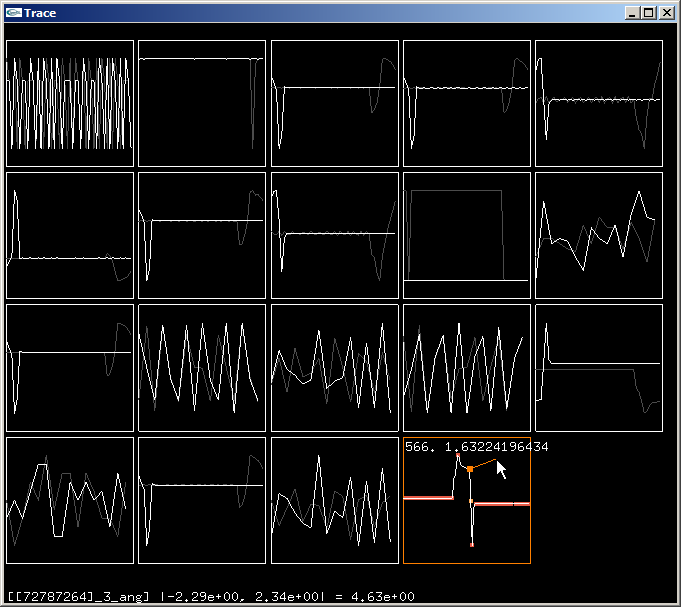
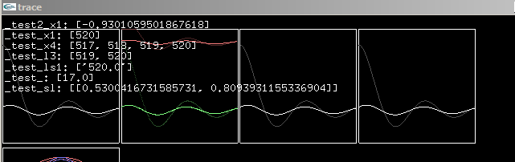
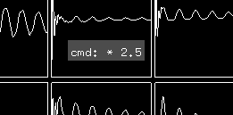
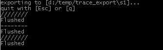
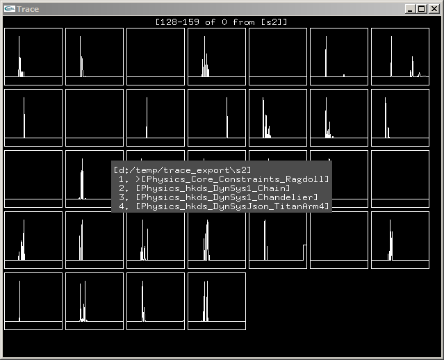

*trace*: *mark or line left by something that has passed*

----------
&nbsp;&nbsp;

*trace* is a tool for graphing and examining data locally or over a network in real-time or off-line.

Examples of using trace include:

 1. Graphing sampled points of data.
 3. Streaming large amounts of data to disk in 'export' mode.
 4. Browsing and viewing data on disk in 'gallery' mode.
 5. Analyzing a graph by examining its zero crossings, extrema and frequency content.

## Tutorial

 0. Check that the everything works fine:
    * Try `'python trace.py -test'`.
    * Try `'python trace.py'`, and then `'python trace_cli_test.py'`, a short burst of graphs should appear on the server.
    * Repeat the above on different machines by specifying the ip of the server when staring the test client using `-ip ...`.
 1. Start the server: `'python trace.py -n 128'`, an empty window with the title 'trace' appears.
 2. Include the c++ header in your code: `#include "trace.h"`.
 3. Send a number of points by calling `trace_test1()` which is implemented as follows:

 		for (float i=0; i<128.0f; i+=1.0f)
		{
 			trace::point("sin", sinf(i/32.0f), trace::HexFloat);
	 		trace::point("cos", cosf(i/32.0f), trace::HexFloat);
			trace::point("sin+cos", sin(i/32.0f) + 0.2f*cosf(i/2.0f), trace::HexFloat);
		}

 4. Send a number of timings by calling `trace_test2()` which is implemented as follows:

 		for (float i=0; i<128.0f; i+=1.0f)
		{
			trace::TimeInterval t;
			{ t.start(); Sleep(30); t.stop(); }
			trace::point("time", (float) toMillis(t.t), trace::Float);
		}

 5.	Observe your graphs in the server's window.

## Terminology

 * A *point* has a certain *type*.
 * A *data* is a list of *points*, it has a name and can be visualized using a *representation*.
 * A *representation* has a name, it is either a *graph* or a *stat*.

## Using the Client

The client is a single standalone c++ header file and can therefore be integrated without much trouble.

The client connects silently and auto-magically to the IP address '127.0.0.1' and a fixed port. If this is successful, a message is printed to the console. Otherwise, all tracing fails silently. To connect to a remote server, trace::first_connect([ip], [port]) is to be called before any other call.

#### Basic Usage

Basic usage of the client amounts to no more than sending points to the server with a one-liner.
We illustrate this using a complete set of examples. We assume the existence of a function f() that generates data.

Examples for displaying data in a graph:

 * `trace::point("data1", (float) f(), trace::Float);		// Graph 'data1' with points from f().`
 * `trace::point("data1", (int) f(), trace::Int);			// ditto, with integers.`
 * `trace::point("data1", (double) f(), trace::Double);		// ditto, with doubles.`
 * `trace::point("data1", (float) f(), trace::HexFloat);	// ditto, but sending the points as hexadecimals so that they correspond exactly on the server side.`
 * `trace::point("data1", (double) f(), trace::HexDouble);	// ditto, with doubles.`

#### More Possibilities

All of the examples above can be used with two additional functions:

 * `trace::spoint`, which represents the data using a stat, that is, in a text box.
 * `trace::ppoint`, which accumulates the data before representing it as a stat. Sending '1' four times will display '4'.

In most cases, it is not necessary to specify graph properties but when desired, it can be done by configuring a named graph using `trace::graph`:

 * `trace::graph("graph1", "y", /*fit*/ false, /*min*/ -2.0f, /*max*/ 5.0f, /*render using lines*/ false); `

and then binding it:

 * `trace::point("data1", (float) f(), trace::Float, "graph1");	// Now 'data1' is bound to 'graph1' for displaying purposes.`

The same technique works for `spoint` in combintaiton with `trace::stat` which accepts a parameter which starts with either 'n' or 'p' followed by a natural number:

 * `trace::stat("stat1", "n4"); // Displays the last four points. That is: 1,2,3,4 then, 2,3,4,5, etc. `
 * `trace::stat("stat1", "p4"); // Displays four periodic points. That is: 1,2,3,4 then, 5,6,7,8, etc.`

One can also simply send text to the server to be be printed:

 * `trace::print("hello");	// Prints "hello" on the console of the server.`

Finally, one can display the frame rate of the client on the server (a client is identified by to its ip and port and this is reflected in the name of the graph) by calling either one of the following once per frame:
 * `trace::sfps(); // Displays frame rate as a stat`
 * `trace::gfps(); //Displays frame rate as a graph`

#### Limitations
 * The client does not support multi-threading.
 * The client does not protect against buffer over-runs.

## Using the Server

The server is a single python file, requiring no packages. I use Python 2.7.6 and have not tested other versions.
To start the server simply use `'python trace.py'`. For a glimpse of the basic functionality use `'python trace.py -test'` and press tab to switch between the two windows.

#### Basic Usage
The basic and default server mode is the 'real-time' mode. The server waits for data and displays it. Multiple clients can be active at the same time, but one must watch out for data name clashes. The server window can be resized at will and it will try to optimally accomodate all the graphs in display.

##### Hovering With the Mouse
Hovering the mouse over a specific graph gives it focus. When a graph is in focus, the following happens:

 * The name, minimum, maximum and range of the associated data are shown at the bottom of the trace window.
 * The closest point to the mouse pointer is found, highlighted and its coordinates are displayed.
 * The display changes from two-fold (where the data is split into two halves and the first half is displayed in gray) to one-fold, the extrema are highlighted in orange, while the zero-crossings are highlighted in yellow.

It is possible to make the focus graph exclusively grab the full window by middle-clicking on it. Middle-clicking once more reverts this.

##### Selecting Graphs
A number of commands act on the currently selected graphs. The set of selected graphs comprises the current hover-focused graph, along with all graphs explicitly selected with a right mouse click. Pressing *'a'* inverts the current selection. This allows for easily selecting all graphs when none is selected and vice versa.

##### Issuing Command Shortcuts
Command shortcuts are single key-press shortcuts to common commands. The most common are:

 * **a**: Inverts the current graph selection.
 * **t**: Toggles the closest point tracking feature.
 * **h**: Hides the selected graphs.
 * **u**: Un-hides all hidden graphs.
 * **k**: Kills the selected graphs. Use this to clear the display, especially in combination with **'a'**.
 * **b**: Blocks the selected graphs from accepting client input.
 * **f**: Toggles range fitting if there is only one graph selected. Turns it off if multiple graphs are selected.
 * **F**: Turns range fitting on if multiple graphs are selected.
 * **l**: Toggles 'life' range fitting. 'Life' range fitting uses all the data within the life of the graph instead of only the data currently in display.
 * **L**: Turns 'life' range fitting on if multiple graphs are selected.
 * **p**: Pauses the server, freezes drawing updates.
 * **d**: Prints information about all current datas.
 * **r**: Toggles the hover-focused representation between graph and stat if the data type allows.
 * **F1**: Prints a help summary to the command line.
 * **F2**: Toggles graph analysis for all graphs, instead of only the focused one.
 * **F3**: Switches to frequency mode for all graphs. If not explicitly set by the client, the sampling period is assumed to be 60 Hz, but can be changed with the **'hz'** command.
 * **F5**: Switches the color scheme. There is the default black one, and a white one optimizing for printing to paper.

##### Issuing Commands
Issuing a command starts by pressing **`** to open the command console which pops up in the center of the window. Pressing enter executes the current command. Python exceptions that happen during the execution, potentially due to malformed commands, are caught and printed on the command line.

The most common commands are:

 * **\* v**, where v is a number: Multiplies the number of display points by **v**. The default number is 32. It can also be changed at startup using a command line option: `'python trace.py -n 128`
 * **only csv**: Using a comma separated list of strings as a filter. Only graphs that contain one of the strings are displayed.
 * **hide csv**: Using a comma separated list of strings as a filter. All graphs that contain one of the strings are hidden.
 * **all**: Resets the **'only'** and **'hide'** filters.
 * **conv name**, where **name** is one of (**deg-rad**, **m-cm**, **id**). Uses the specified conversion when displaying closest point data for all graphs.
 * **hz v**: Sets the default sampling period for the frequency mode to **v**, unless it is explicitly set by the client.
 * **freq**: Toggles the frequency mode.

#### 'Export' Usage

Instead of displaying data in real-time, the server can be set to 'export' mode: `'python trace.py -export d:/trace_export'`. In this mode, there is no display window, and the server works in console mode. When no data is being received, the server is idle. When there is incoming data, the server indicates this with a spinning text. The server does not directly write data to the file system, but only at certain intervals, or after a short amount of inactivity. It is always safe to close the server when the last line on the command line says 'Flushed'.

In this mode, a number of additional command line options are available:

 * **-auto_sess**: Automatically creates a numbered subdirectory within the set base directory and uses it for this 'session', i.e. until the server is closed.
 * **-clear**: Clears the base directory at startup (use with care).
 * **-last_sess**: Uses the last numbered sub-directory, or creates one if none was found.

On the client side, an additional function is available which allows sending a three-tuple point using `trace::point3`. Each of the three values gets its own graph in gallery mode although they are exported to a single file.

#### 'Gallery' Usage

Files created during 'export' can be examined by starting the server in 'gallery' mode and specifying a directory: `'python trace.py -gallery d:/trace_export'`.

In this mode, these additional shortcuts are available:

 * **Enter**: Starts the directory browsing dialog if it is closed. If it is open, starts displaying the graphs in the current directory if any.
 * **Left Arrow**: Within the browsing dialog, moves up one directory. Outside of it, moves to the previous batch of files.
 * **Right Arrow**: Within the browsing dialog, enters the currently selected directory. Outside of it, moves to the next batch of files.
 * **Down Arrow**: Moves down in the directory list.
 * **Up Arrow**: Moves up in the directory list.

Additionally, these command line options are available:

 * **-max_files n**, where n is a natural number: Displays **n** files at a time.
 * **-last_sess**: Uses the last numbered sub-directory used during 'export'.

#### Limitations
 * When the server gets flooded with points, it grinds to a halt. That being said, it can handle a good amount before this starts to happen.
 * The server does not automatically acquire window focus when the mouse hovers over it. This can be irritating.

## Possible Improvements
 1. Implementing client-side multi-threading.
 2. Changing the protocol to use json fragments.
 3. Implementing batching and flushing on the client side. This should improve the server performance dramatically.
 4. Improving the server performance. For hints on where to start one can use the built-in profiler: `'python trace.py -profile'`.

# Dependencies
 - Using Conda (the easier alternative)
   * [Conda](https://conda.io/docs/install/quick.html)
   * `conda install pyopengl`
   * `conda install -c conda-forge freeglut`
 - Using Python
   * [Python 2.7](https://www.python.org/downloads/)
   * [PyOpenGL](http://pyopengl.sourceforge.net/documentation/installation.html)
   * For glut on windows, you will have to [find](https://mycodelog.com/2010/05/15/gllibs/) the [DLLs](http://originaldll.com/search?q=glut) and [place them](https://w3.cs.jmu.edu/bernstdh/Web/common/help/cpp_mingw-glut-setup.php) either in system folders or in the directory of trace.
